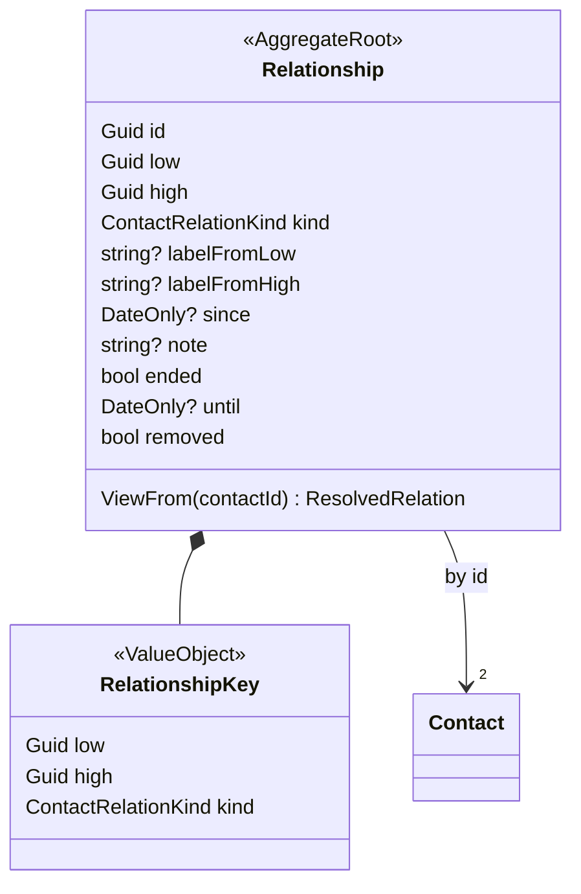

# Contact relationships

A relationship between two contacts is its own record, the `Relationship` aggregate. It belongs to
neither contact, so no surface (REST, MCP, the describe seam, the sync adapter) can show which side
"holds" it.

- **Identity:** `RelationshipKey` reads "high is low's kind", with low and high in the ids' ordinal
  string order. The stream id is derived from the key, so "X is Y's Parent" and "Y is X's Child" are
  the same stream.
- **Per side:** each contact has its own label, its word for the other ("dad" on the child's side,
  "son" on the parent's).
- **Shared:** since, note, ended and until belong to the relationship.
- **Removal:** a removed relationship stays as a tombstone (`removed`) for the sync feeds. Stating it
  again starts it afresh on the same stream.
- **Integrity:** there is no foreign key to the contacts. A relationship whose other contact is deleted
  or unreadable is filtered out on read.

## Contract

- **Listing:** `GET /contacts/{id}/relations` returns `Relationship.ViewFrom(id)` for each relationship
  whose other contact is live and readable. The `kind` is the other contact's role relative to `{id}`,
  and the `label` is `{id}`'s own word for them.
- **Changes:** `POST /contacts/{id}/relations`, `POST …/{toContactId}/end` and
  `DELETE …/{toContactId}?kind=` accept either contact as `{id}`. Upsert and end return the view from
  `{id}`; delete returns 204.
- **Access:**
  - Read on both contacts.
  - Write on at least one of their books.
  - A label needs write on the labelling contact's book.
- **`GET /relationships`:** every relationship whose two contacts the caller can read.
- **`GET /sync/relationships?since=`:** the mirror feed, unpaged.
  - The cursor works like `/sync/changes`: a readable-books scope, which resets when access changes.
  - It also re-sends the relationships of every contact touched past the cursor, because deleting or
    moving a contact changes what is visible.
  - Tombstones come only in deltas.

## Sync adapter

- **Export:** a contact's card lists its relationships as seen from it.
- **ETag:** the card's ETag covers the contact's `ContentHash` and those relationships. A relationship
  edit therefore moves the ETag of each card it shows on, and the change feed lists both contacts.
- **Import:** an imported card restates the relationships it lists from its own side. Its label is that
  contact's word; the note is not on the card and is kept. A relationship the card no longer lists is
  removed. A card without relation lines leaves them all alone.

## Legacy

`ContactRelation*` events on `Contact` streams are the old per-contact relation copies. They stay
registered so old streams still replay; `Contact` does not apply them.
