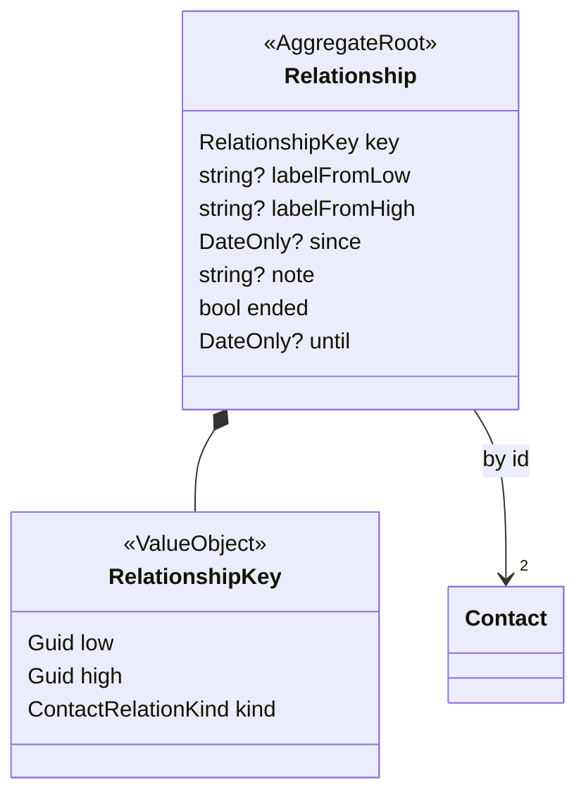

# Contact relationships

A relationship between two contacts reads the same from both sides. No surface (REST, MCP, the
describe seam) shows which contact stores it.

## Contract

- `GET /contacts/{id}/relations` returns one entry per (other contact, kind). `kind` is the other
  contact's role relative to `{id}`: X is Y's `Parent` ⇔ Y is X's `Child`.
- **Per side:** `label` is `{id}`'s own name for the other ("dad" on the child's card, "son" on the
  parent's).
- **Shared:** `since`, `note`, `ended`, `until` belong to the relationship and read the same from both
  sides.
- `POST /contacts/{id}/relations`, `POST …/{toContactId}/end` and `DELETE …/{toContactId}?kind=` accept
  either contact as `{id}`. Upsert and end return the entry as `{id}` sees it; delete returns 204.
- **Access:** read on both contacts, plus write on each stored copy the call changes.

## Storage

Each side may hold a copy: a `ContactRelation` on its own `Contact` stream, "the To contact is my
Kind". `Domain/Relationships/RelationResolver` merges the copies. `RelationshipKey` gives a relationship
the same identity whichever side holds a copy and whichever side is viewing.

| Field | Where it is written | How a read resolves it |
|---|---|---|
| label | the writer's own copy, created on demand | the viewer's own copy |
| since, note | every copy | the Low contact's copy, falling back to the other |
| ended, until | every copy | ended only when every copy is |

- **First write, unlabelled:** the relationship goes on the side the caller can write.
- **Upsert from the other side, no label:** revises the existing copy in place. It adds no second copy.
- **The sync adapter** still exports and replaces one contact's own copies. Inference
  (`KinshipInference`, `CircleInference`) reads copies from either side.
- **`ContactDto.relations`** is storage, the copies this contact holds. Clients render the merged
  listing, never this field.

## Follow-up: `Relationship` aggregate

Move relationships out of contact streams, so ownership stops existing in storage as well as on the
API. The contract above does not change.

1. **Stream:** `Relationship` stream id = `DeterministicGuid.From(key)`. Events go in
   `Domain/Relationships/Events/`. Add a projection indexed on both contact ids; it replaces the
   `Relations.Any(r => r.ToContactId == id)` scan.
2. **Migration:** replay each contact's `ContactRelation*` events. Group the copies by `RelationshipKey`.
   `labelFromX` = the label on X's copy. The other fields follow the resolver's merge rules in the table
   above.
3. **Service:** `ContactService` relation methods address the stream by key. The `own` / `theirs`
   placement logic and the copy-level idempotency go away.
4. **Sync adapter:** each contact's exported relations are derived from its relationships. An import
   diffs against them and issues commands. Both contacts' content hashes include the derived relations.
5. **Removals:**
   - `ContactDto.relations`, `ContactRelationsReplaced`, and `Contact.Relations` (keep them for replay
     only).
   - LupiraCal mobile's `relationCopiesOf` mirror query. It switches to a relationships feed and keeps
     `resolveRelations`' output shape.
