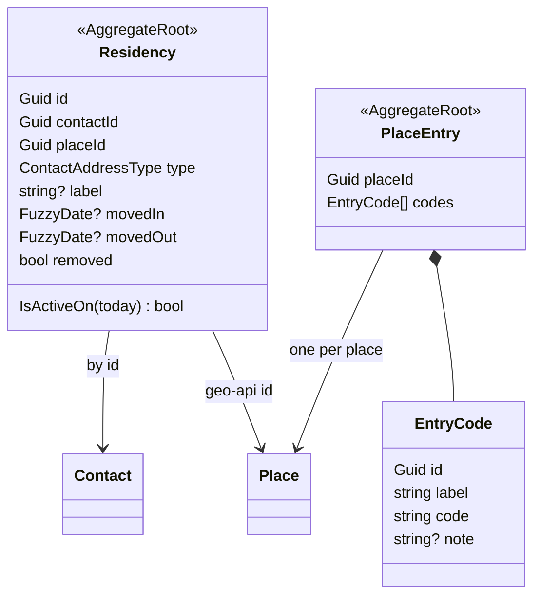

# Residencies and door codes

Where a contact lives, holidays and works is a `Residency`: its own record, one per period at a geo
place. Door and gate codes belong to the place, in a `PlaceEntry` shared by everyone living there.

## Residencies

- **Fields:**
  - `type`: Home, Vacation, Work or Other.
  - `label`: free text ("Summer house, Gotland").
  - Dates: as precise as known (`FuzzyDate`), null = unknown.
- **Current** means today falls inside the period; ambiguity counts as current (`IsActiveOn`).
  Moving back to a place is a second residency.
- **Rules (`ResidencyRules`):** a residency needs a place id and valid dates in order. It may not
  certainly overlap another of the contact's residencies at the same place. Several current Homes are
  fine.
- **Commands:** add, revise (a correction, wholesale), move out, and remove (a mistake; kept as a
  tombstone for the feed). Writes need write on the contact's book; each accepts an `Idempotency-Key`.
- **`POST /moves`:** contacts who move together. For each contact, current residencies at
  `fromPlaceId` end on `movedIn`, and a residency at `toPlaceId` starts then. All or nothing.
- **Reads:**
  - `GET /contacts/{id}/residencies`: one contact's, current first.
  - `GET /residencies`: everything readable.
  - `GET /sync/residencies?since=&limit=`: paged and scoped like `/sync/contacts`. A delta also re-sends
    the residencies of contacts changed since the cursor, because deletes and moves change visibility.
- **Derived from residencies:**
  - Household circle: a shared current Home; Vacation never makes a household.
  - Completeness: `postalAddress` needs a current residency.
  - Geo's orphan check: residencies of live contacts count as live, residencies of deleted contacts as deleted.

## Door codes

- **One per place.** A `PlaceEntry` holds several `EntryCode`s. The client mints each code's id.
- **Who sees it:** you see a place's codes while you can read a live contact with a current residency
  there. You change them while you can write one.
- **Endpoints:**
  - `GET /places/{placeId}/entry`
  - `PUT` and `DELETE /places/{placeId}/entry-codes/{codeId}`
  - `GET /sync/place-entries?since=&limit=`, paged; a delta re-sends places whose residencies or
    residents changed. Tombstones are place ids.
- **What's affected by time:** a move-out date passing changes visibility without any event. Mirrors
  therefore show codes only where they still have a current resident, and the next full sync drops the
  rest.
- **Never exposed through:** the sync adapter's cards, the describe seam, or MCP. The event stream is
  the audit trail of who changed which code.

## Legacy

`ContactAddressesReplaced` events on `Contact` streams are the old per-contact address lists. They stay
registered so old streams still replay; `Contact` does not apply them.
